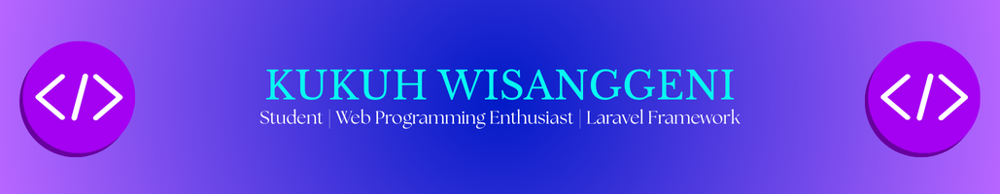

## Hello World! Welcome to My Github Profile 👋

#### 👋 About Me

Hi! I'm **Kukuh Wisanggeni**, a Computer Science student with a strong passion for programming and application development. I enjoy building digital solutions—both desktop and web apps—that help simplify everyday tasks.

💡 Some things I love doing:
- Developing **point-of-sale (POS)** and **management systems**
- Exploring and experimenting with **Laravel**, **C#**, and **Java**
- Creating functional and user-friendly projects

🚀 I'm currently learning and improving my skills in:
- Web & desktop application development
- Database management
- User-centered UI/UX design

🔧 Tools I often use:
`C#` | `PHP (Laravel)` | `Java` | `HTML/CSS` | `MySQL`

📫 Feel free to connect with me or check out the repositories I've built. I'm always open to collaboration and tech discussions.

---

##### Languages

##### Framework

##### Text Editor

##### Social

##### My Github Stats

<!--
**firetoxicant/firetoxicant** is a ✨ _special_ ✨ repository because its `README.md` (this file) appears on your GitHub profile.

Here are some ideas to get you started:

- 🔭 I’m currently working on ...
- 🌱 I’m currently learning ...
- 👯 I’m looking to collaborate on ...
- 🤔 I’m looking for help with ...
- 💬 Ask me about ...
- 📫 How to reach me: ...
- 😄 Pronouns: ...
- ⚡ Fun fact: ...
-->
